# FDA  Submission

**Your Name: Luke Wicent Sy**

**Name of your Device: Clinical Decision Support Tool for Diagnosing Pneumonia using Xrays**

## Algorithm Description 

### 1. General Information

**Intended Use Statement:** 
for assisting the radiologist in the detection of pneumonia from Xray scans

**Indications for Use:**

This algorithm is intended for use on men and women from the ages of 18-65 who have been administered an Xray chest scan with Posterior Anterior (PA) and Anterior Posterior (AP) view.

**Device Limitations:**

This algorithm has poor precision, hence, has limited usability for confirming Pneumonia diagnosis.
The algorithm requires around 0.5 second to classify an Xray image, hence, has limited usability for real-time screening.

**Clinical Impact of Performance:**

The algorithm has good specificity/recall and bad precision, which means we can be most confident when the classification is negative (ie, no findings).
After a radiologist screens a scan, if the algorithm indicates *No Finding*, the chances to review the scan is reduced.

Furthermore, the algorithm may be used for worklist prioritization in case there is an influx of chest Xray scans. The radiologist can prioritise diagnosing Xray scans which returned positive.

The availability of this tool can give radiologist confidence if they are unable to find pneumonia from the Xray scan.
In the case of this algorithm being used for worklist prioritization, the default view setting shall hide the algorithm output which informs the priority queue. This is to prevent giving the radiologist false bias (eg, look at a scan less critically) in diagnosing scans where the algorithm classified it as negative.

### 2. Algorithm Design and Function

**DICOM Checking Steps:**

1. Check that *body part examined* by X ray scan is *chest*
1. Check that *patient position* when X ray was taken are either *PA* or *AP*
1. Check That image *modality* is *DX* (ie, Digital X ray).

**Preprocessing Steps:**

The image was resized to 224 x 224 and the pixel values were multiplied by 1/255 such that the pixel value will range from 0.0 to 1.0.

**CNN Architecture:**

The CNN architecture was based on VGG16 (image below). The architecture was modified as shown in the image next to VGG16.

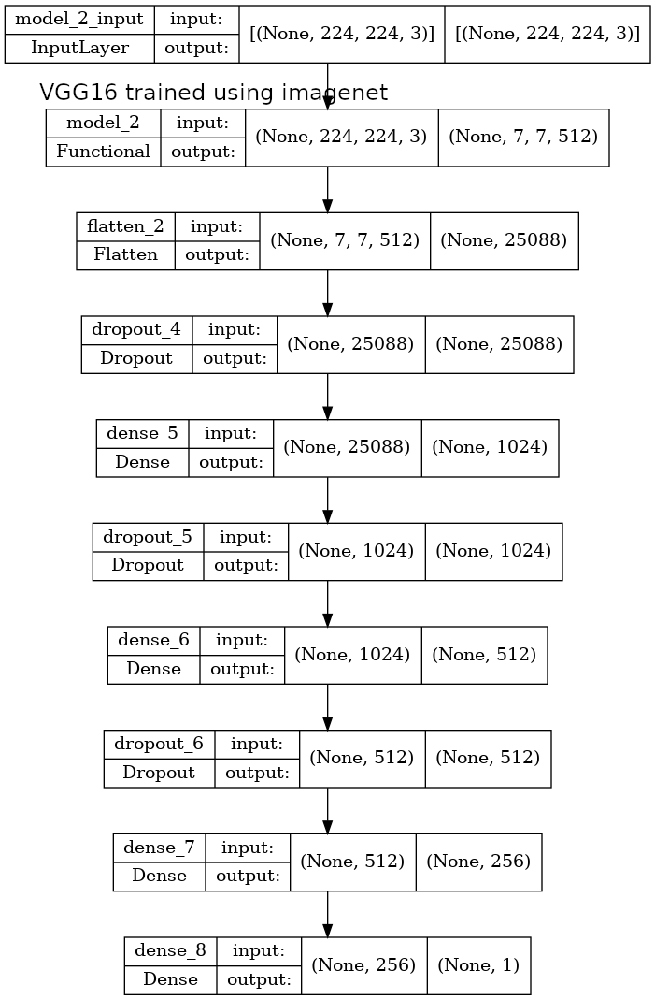

### 3. Algorithm Training

**Parameters:**

***Types of augmentation used during training***

* Pixel value rescaling factor of 1/255
* Image is flipped horizontally, but not vertical
* Height and width shift range of 0 to 0.1 of total height and width, respectively
* Rotation range of 0 to 20 degrees
* Shear range of 0 to 0.1 shear intensity
* Zoom range of 0.9 to 1.1 of original image size

Sample of augmented images are shown below.
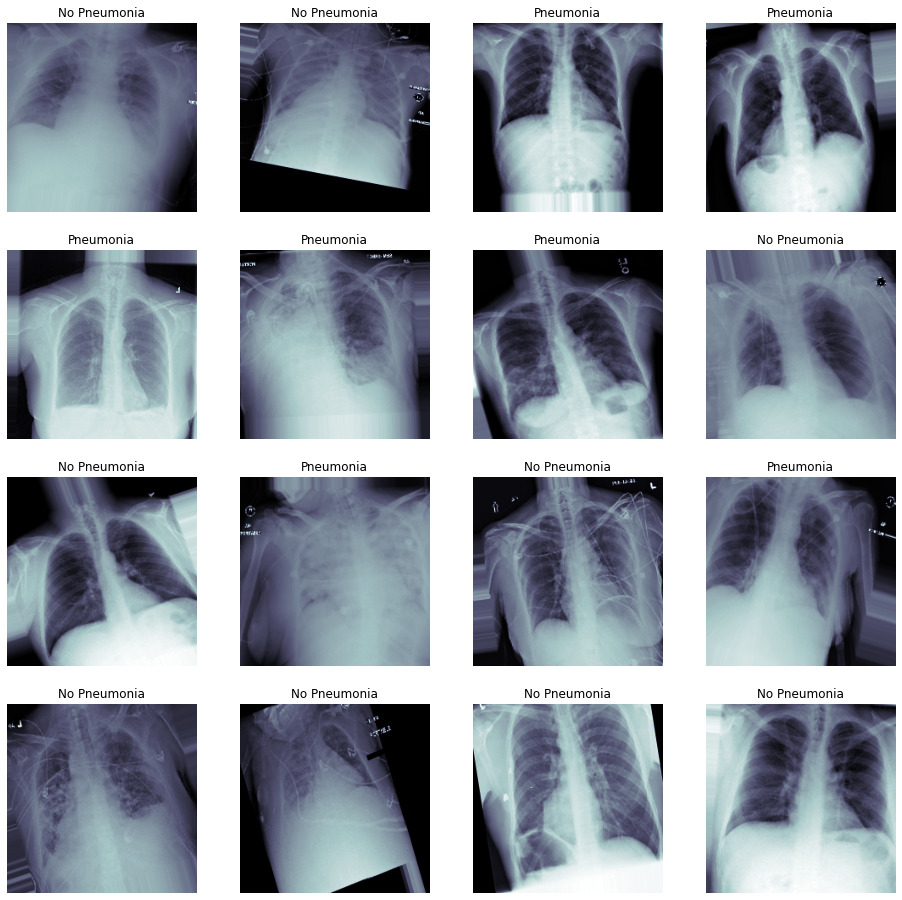

***Batch size***

The batch size was 10 (ie, the full training set was used after 10 epochs)

***Optimizer learning rate***

An Adam optimizer with learning rate 1e-4 was used. The loss function was binary_crossentropy, and the metric used was binary_accuracy.

***Layers of pre-existing architecture that were frozen***

* input_1
* block1_conv1
* block1_conv2
* block1_pool
* block2_conv1
* block2_conv2
* block2_pool
* block3_conv1
* block3_conv2
* block3_conv3
* block3_pool
* block4_conv1
* block4_conv2
* block4_conv3
* block4_pool
* block5_conv1
* block5_conv2
* block5_conv3

***Layers of pre-existing architecture that were fine-tuned***

* block5_pool

***Layers added to pre-existing architecture***

* Flatten
* Dropout w/ rate 0.5
* Dense w/ size 1024 and activation ReLU
* Dropout w/ rate 0.5
* Dense w/ size 512 and activation ReLU
* Dropout w/ rate 0.5
* Dense w/ size 256 and activation ReLU
* Dense w/ size 1 and activation Sigmoid

**Algorithm Training Performance**

The image below shows the algorithm training performance.

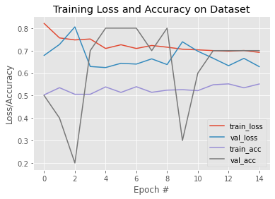

The image below shows the Region of Convergence of the model.

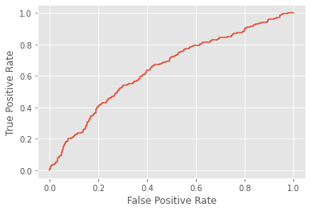

The image below shows the precision and recall curve of the model.

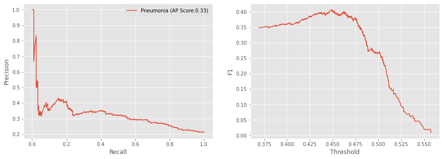

**Final Threshold and Explanation:**

Threshold=0.44886 which has the highest F1 score was selected from the F1 curve.
Note however that threshold=0.384 which has the highest sensitivity/recall may also be chosen.
For reference, the peaks of the F1 curve are listed below.

| Threshold | Sensitivity/Recall | Specificity | Precision | F1 | Accuracy |
| --------- | ------------------ | ----------- | --------- | -- | ---------|
| 0.3841724395751953 | 0.9615384615384616 | 0.07954545454545454 | 0.21528525296017223 | 0.3518029903254178 | 0.263 |
| 0.40320131182670593 | 0.8990384615384616 | 0.19696969696969696 | 0.22721749696233293 | 0.3627546071774975 | 0.343 |
| 0.42015743255615234 | 0.8221153846153846 | 0.33585858585858586 | 0.24533715925394547 | 0.3779005524861878 | 0.437 |
| 0.43714481592178345 | 0.75 | 0.4659090909090909 | 0.2694300518134715 | 0.3964421855146124 | 0.525 |
| 0.44886478781700134 | 0.6682692307692307 | 0.571969696969697 | 0.2907949790794979 | 0.40524781341107874 | 0.592 |
| 0.4623091220855713 | 0.5336538461538461 | 0.6994949494949495 | 0.31805157593123207 | 0.3985637342908438 | 0.665 |
| 0.4751543700695038 | 0.41346153846153844 | 0.7954545454545454 | 0.3467741935483871 | 0.37719298245614036 | 0.716 |
| 0.492322713136673 | 0.23076923076923078 | 0.8863636363636364 | 0.34782608695652173 | 0.2774566473988439 | 0.75 |
| 0.5218532681465149 | 0.0673076923076923 | 0.9696969696969697 | 0.3684210526315789 | 0.11382113821138211 | 0.782 |

### 4. Databases
 **Overview**

The image below shows the demographic overview of the chest X ray dataset. 
It is followed by the demographic overview for the subset of the chest X ray dataset of patients with Pneumonia.
The dataset contains 112120 scans (63340 M, 48789 F) for ages 0 to 90.
The pneumonia subset contains 1431 scans (838M, 593F) for ages 0 to 90. However, the number of scans for < 18 and > 65 years old are limited (< 5 samples).

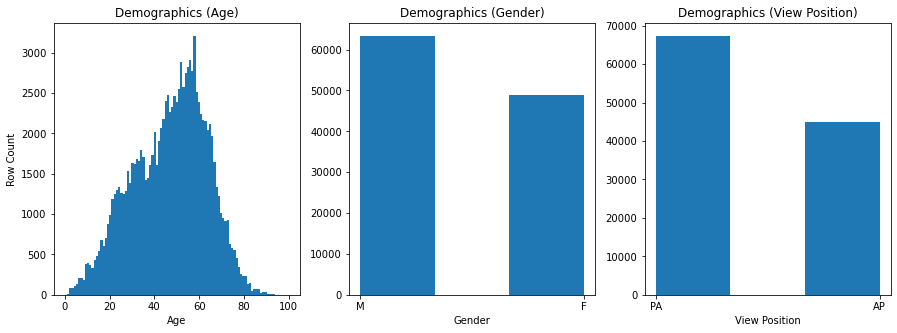
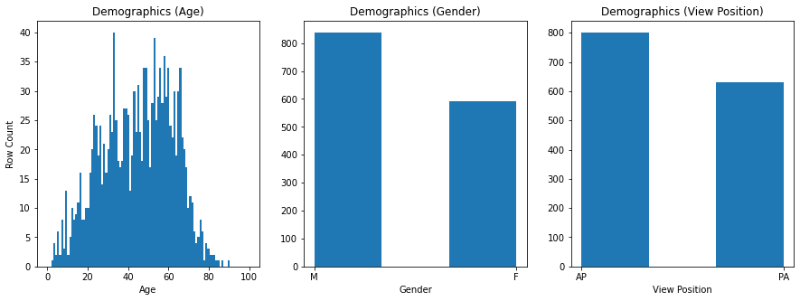

Furthermore, the patients in the dataset who have Pneumonia also tend to have either Atelectasis, Edema, Effusion, or Infiltration, as shown in the image below.

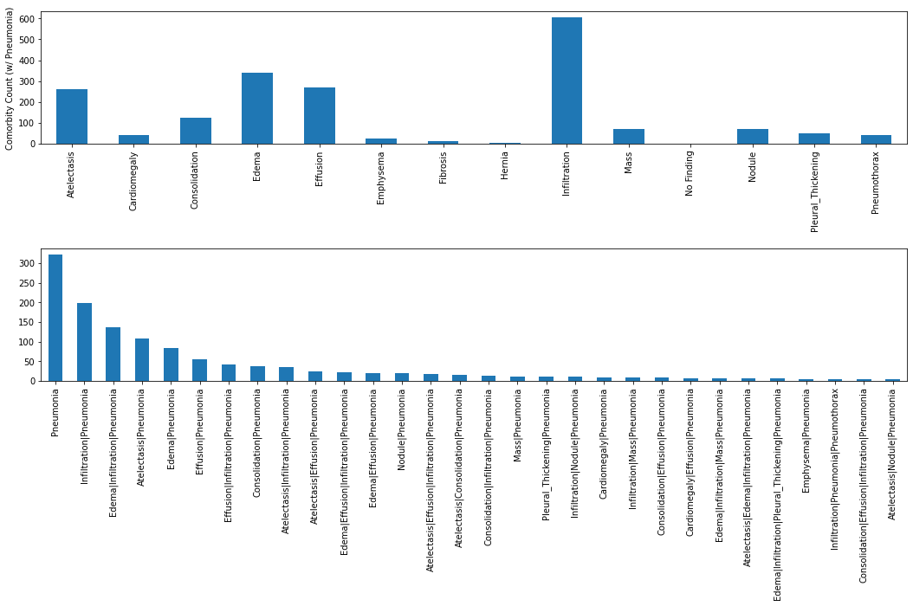

***Example of Xray scans in the dataset***

The following images show sample scans with label *No Findings* and *Pneumonia*

* Labelled *No Findings*
  * 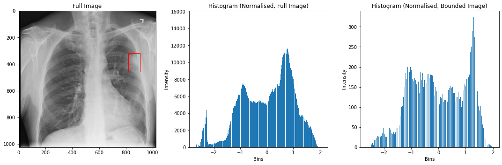
  * 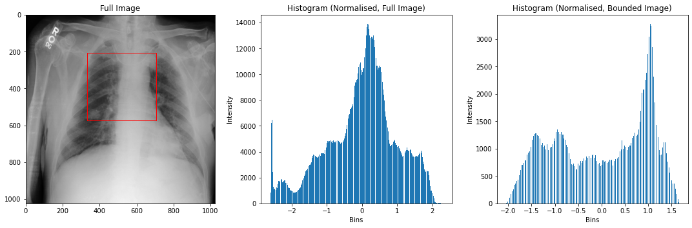
* Labelled *Pneumonia*
  * 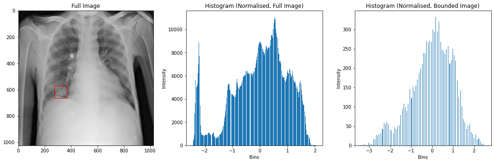
  * 

**Description of Training Dataset:** 

* Contains 2290 rows or samples
* 50% labelled w/ No Findings, 50% labelled w/ Pneumonia

**Description of Validation Dataset:** 

* Contains 1430 rows or samples
* 80% labelled w/ No Findings, 20% labelled w/ Pneumonia

***Example of Validation Results***

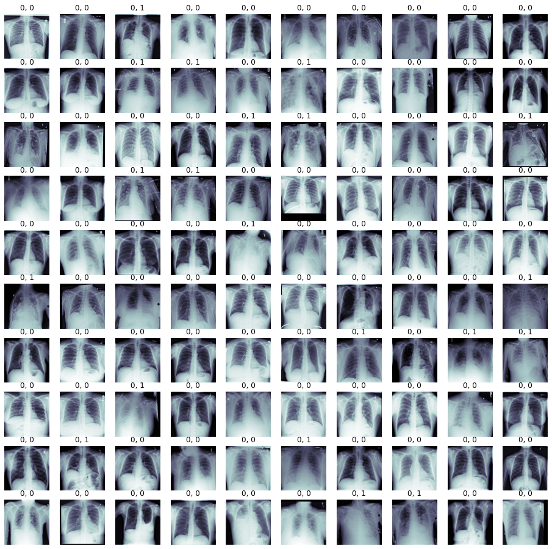

### 5. Ground Truth

The ground truth of the ChestX-ray8 dataset was obtained from associated radiological reports using natural language processing.
The text mining technique used are defined in *Wang et.al ChestX-ray8: Hospital-scale Chest X-ray Database and Benchmarks on Weakly-Supervised Classification and Localization of Common Thorax Disease*.

***Disadvantage***

As not all the radiologist notes are human verified, there is a possibility that the ground truth is erroneous. For example, the radiologist notes may have contained *unlikely to be negative pneumonia*, but the text mining algorithm may labeled it as *No Pneumonia*.

***Advantage***

The dataset contains mostly correct labels and the availability of such a large dataset (unprecented size) has enabled more powerful machine learnings to be trained.

### 6. FDA Validation Plan

**Patient Population Description for FDA Validation Dataset:**

* The patient population shall consists of men and women distributed between the ages of 18-65 whose racial distribution reflects that of the general US population.
* Each patient shall have their standard chest X ray scans frontal view taken.

**Ground Truth Acquisition Methodology:**

The ground truth for the pneumonia classification shall be obtained as follows:

* Each Xray scan is presented to 4 radiologists (one low, one medium, and two high experience).
* Each radiologist shall provide there verdict / classification (with Pneumonia OR No Findings).
* The ground truth shall be decided from the sum of the weighted votes where the low, medium, high1, and high2 experience radiologist have 0.15, 0.25, 0.3, 0.3 votes accordingly. The scan is predicted as with Pneumonia if the sum of weighted votes > 0.5.

**Algorithm Performance Standard:**

| Study | F1 |
| ----- | -------- |
| CheXNet: Radiologist-Level Pneumonia Detection on Chest X-Rays with Deep Learning | 0.435 |