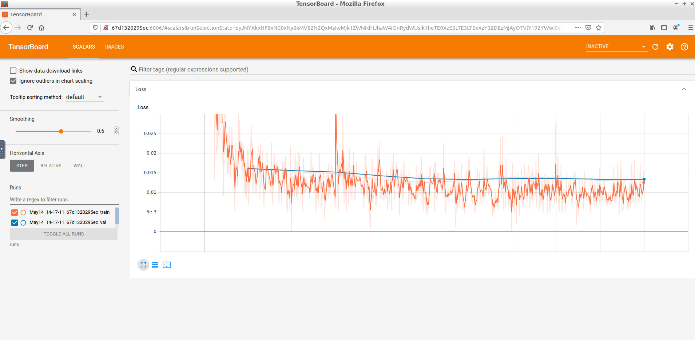

# Hippo AI Validation Plan

**Your Name: Luke Wicent Sy**

**Name of your Device: Image Segmentation Support Tool for Hippocampal Volume Quantification in Tracking Alzheimer's Progression**

## Algorithm Description 

### 1. General Information

**Intended Use Statement:**
for assisting the medical imaging specialist in tracking the Hippocampal volume for tracking Alzheimer's progression from MRI scans

[//]: # ( What data will the algorithm perform well in the real world and what data it might not perform well on? )

**Indications for Use:**

This algorithm is intended for use on men and women from the ages of XX to YY (dataset did not have population range) with average head size (add numerical values here) who have been administered an MRI scan.

**Device Limitations:**

This algorithm depends upon clear MRI scans with input images to the algorithm set to correct and consistent configuration.
The algorithm requires around 0.5 second to perform the segmentation and transmission of data, hence, has limited usability for real-time screening.

**Clinical Impact of Performance:**

The algorithm has acceptable DICE and Jaccard score (0.9 and 0.8 respectively), which means the algorithm can be utilised to automate the process of Hippocampal volume estimation. However, as the score is not near perfect, validation of the result by a medical imaging specialist is still required. Ideally, tools to modify the estimated volume according to the opinion of the imaging specialist must be provided to ensure medical opinion feedback is accounted for.

The algorithm assumes the 3D patch of the Hippocampus is provided by the medical imaging specialist. If the full 3D image is provided, further validation is required to determine effectiveness of the algorithm.

In extreme situation (e.g., developing countries with limited medical imaging specialist), the estimated volume may be used for worklist prioritization in case there is an influx of MRI scans. In the case of this algorithm being used for worklist prioritization, the default view setting shall hide the algorithm output which informs the priority queue. This is to prevent giving the medical imaging specialist false bias (eg, look at a scan less critically).

### 2. Algorithm Training

**Parameters:**

***No augmentation was used during training (future work)***

***Batch size***

The batch size was 8 (ie, the full training set was used after 10 epochs)

***Optimizer learning rate***

An Adam optimizer with learning rate 0.0002 was used. The loss function was cross entropy.

***Machine learning architecture used***

Standard UNet layers with patch size 64 x 64, number of classes 3 was utilised. Refer to https://arxiv.org/abs/1505.04597

**Algorithm Training Performance**

The image below shows the algorithm training performance (i.e., cross entropy loss).

The algorithm performance was measured using the following metrics:
1. Dice Coefficient = 2 | X intersect Y| / (|X| + |Y|)
1. Jaccard Similarity Coefficient = | X intersect Y| / | X union Y|

### 3. Ground Truth

The ground truth of the dataset was obtained by segmenting the patch where the Hippocampus is from the full MRI 3D scan, then was manually labelled which image counts towards the volume.

## FDA Validation Plan

**Patient Population Description for FDA Validation Dataset:**

* The patient population shall consists of men and women distributed between the ages of 18-65 whose racial distribution reflects that of the general US population.
* Each patient shall have their MRI scan of the brain
* A medical imaging specialist shall localise the patch that contains the Hippocampus

**Ground Truth Acquisition Methodology:**

The ground truth for the image segment classification shall be obtained as follows:

* Each MRI scan shall be pre-processed where the local patch containing the Hippocampus is used instead of the full scan, and a manual segmentation of the Hippocampus volume is pre-labelled.
* The total volume shall be calculated and compared with average Hippocampus volume from the Biobank (http://www.smanohar.com/biobank/calculator.html) as sanity check.
* Each MRI scan is presented to 4 medical imaging specialist (one low, one medium, and two high experience).
* Each medical imaging specialist shall modify existing segmentation.
* The ground truth shall be decided from the sum of the weighted segmentation where the low, medium, high1, and high2 experience medical imaging specialist have 0.15, 0.25, 0.3, 0.3 votes accordingly. The final segmentation is a threshold > 0.5 with blending.

For a smaller subset of the dataset (i.e., just the last data point) and for patients who donated their body to science, histology of the Hippocampus may be done (e.g., extracting the Hippocampus then measure its volume and weight).
